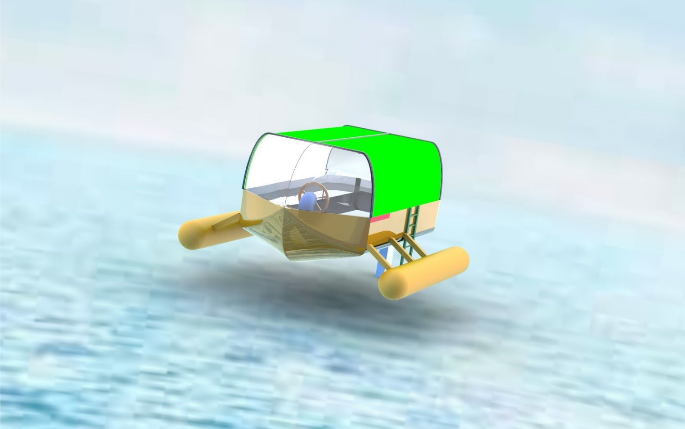

# Maritime Life Support Device

>Poseidon takes you the rest of the way, when your ship couldn't.

---

## Description

This is one of the first major projects I was involved in at university. The project was done in a team of four, where each was deligated a certain responsibility at each stage of design. 
This project goes through the full design process, starting from finding reference designs, creating personas and use cases. From the use cases, a system identification process was begun to meet the requirements of each use case. 
After this initial abstraction of the systems, a morphological matrix was made of possible designs for each of the systems.
Using a weighted scoring method the relative value of each system design was scored, the best systems were selected and an initial concept was rendered. 
In the paper you will find the details of the design process and why each component is the way it is. 

    This  project is meant to show how I and the rest of the team can solve problems where we have no previous knowledge on. 

### Technologies

- SolidWorks
- draw.io (flowcharts)

[Back To The Top](#maritime-life-support-device)
